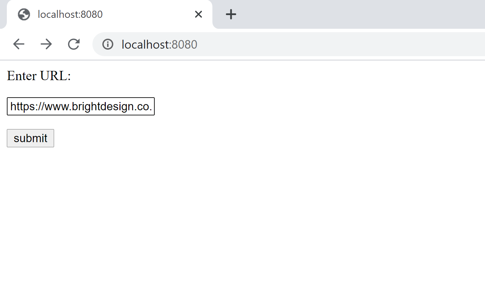
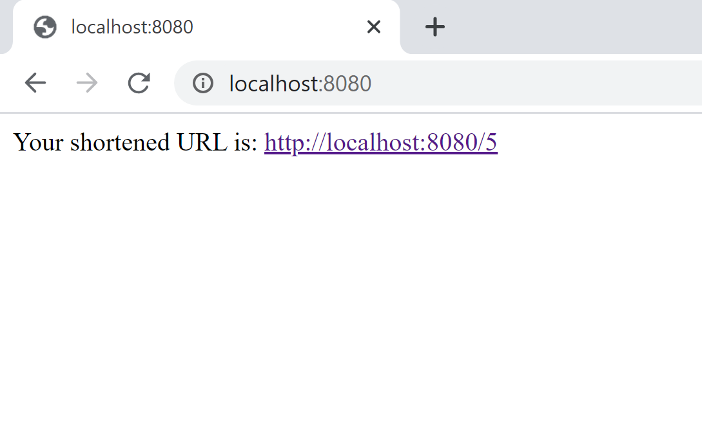

# URL Shortener

This is a small url shortener application.

## Features

- Converts the given url to a shorter url using base62 encoding 
- Built using flask
- Database : sqlite3
- Simple UI
- Redirects to the original url on clicking the short url

## Usage
Docker image

```sh
https://hub.docker.com/repository/docker/akhilareddyvanga/url_shortener
```

Pull and run image

```sh
docker pull akhilareddyvanga/url_shortener:latest
docker run -d -p 8080:8080 akhilareddyvanga/url_shortener:latest
```

Execution
```sh
curl -X POST -F 'url=<url to shorten>' http://localhost:8080/
```
Result
```sh
<html>
<body>
   <div>
      Your shortened URL is: <a href="http://localhost:8080/<short_url>"> http://localhost:8080/<short_url></a>
   </div>
</body>

```
For UI view navigate to http://localhost:8080/ in your preferred browser.

```sh
http://localhost:8080/
```
EXAMPLE :
Request
```sh
curl -X POST -F 'url=https://www.brightdesign.co.uk/5-of-the-best-website-designs-according-to-the-internet' http://localhost:8080/
```
Response:
```sh
<html>
<body>
   <div>
      Your shortened URL is: <a href="http://localhost:8080/5"> http://localhost:8080/5</a>
   </div>
</body>
```
## Screenshots
Home page


On clicking Sumbit


After redirection


