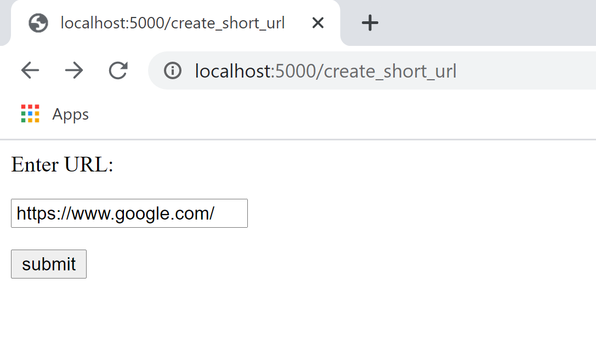
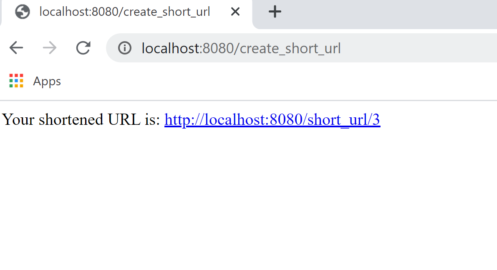
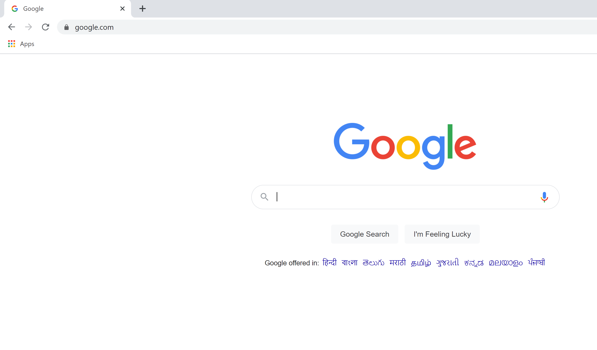

# URL Shortener

This is a small url shortener application.

## Features

- Converts the given url to a shorter url using base62 encoding 
- Built using flask
- Database : sqlite3
- Simple UI
- Redirects to the original url on clicking the short url

## Usage
Docker image

```sh
https://hub.docker.com/repository/docker/akhilareddyvanga/url_shortener
```

Pull and run image

```sh
docker pull akhilareddyvanga/url_shortener:latest
docker run -d -p 8080:8080 akhilareddyvanga/url_shortener:latest
```

Execution
```sh
curl -X POST -H "Content-Type: application/json" http://localhost:8080/create_short_url -d '{"url": <url_to_shorten>}'
or
curl -L -X POST "http://localhost:8080/create_short_url" -F 'url="<url_to_shorten>"'
```
Result
```sh
<html>
<body>
   <div>
      Your shortened URL is: <a href="http://localhost:8080/short_url/2"> http://localhost:8080/short_url/2</a>
   </div>
</body>
</html>

```
For UI view navigate to http://localhost:8080/create_short_url in your preferred browser.

```sh
http://localhost:8080/create_short_url
```
EXAMPLE :
Request
```sh
curl -X POST -H "Content-Type: application/json" http://localhost:8080/create_short_url -d '{"url": "google.com"}'
```
Response:
```sh
<html>
<body>
   <div>
      Your shortened URL is: <a href="http://localhost:8080/short_url/2"> http://localhost:8080/short_url/2</a>
   </div>
</body>
</html>

```
## Screenshots
Home page


On clicking Sumbit


After redirection



